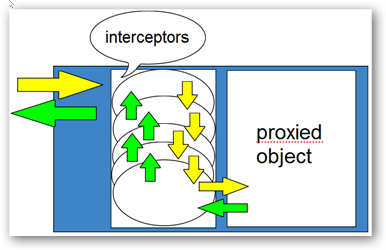

# Castle 动态代理 - 简介

Castle 动态代理 是一个用于在运行时动态生成轻量级.NET代理的库。 代理对象允许在不修改类代码的情况下截取对对象成员的调用。

DynamicProxy与内置在CLR中的代理实现不同，后者要求代理类继承MarshalByRefObject。 继承`MashalByRefObject`来代理一个对象可能太麻烦了，因为它不允许类继承另一个类，也不允许透明的类代理。 此外，Castle 动态代理还提供了标准CLR代理无法提供的功能，例如，它允许您混合多个对象。

## 要求

要使用Castle 动态代理，您需要以下环境:

* 已安装以下运行时之一
  * .NET Framework 4.5+
  * .NET Core 2.1+
  * 任何其他支持.NET Standard 2.0+和使用System.Reflection.Emit生成运行时类型的.NET平台
* `Castle.Core.dll` (动态代理所在的程序集)

:information_source: **DynamicProxy 程序集:** 在以前的版本（v2.2之前的版本）中，DynamicProxy存在于其自己的程序集“ Castle.DynamicProxy.dll”中。 后来将其移至“ Castle.Core.dll”，现在不需要其他程序集即可使用它。

## 代理

首先，DynamicProxy的用途是什么？为什么要关心它？ DynamicProxy（简称DP），顾名思义，是一个可帮助您实现代理对象设计模式的框架。 动态意味着实际创建代理类型是在运行时进行的，您可以动态地组成代理对象。

根据维基百科：

> 在最常见的情况下，代理是一个类，它充当另一件事的接口。 另一件事可能是任何东西：网络连接，内存中的大对象，文件或其他昂贵或无法复制的其他资源。

通过电影《黑客帝国》，来帮助理解代理。


矩阵可作为代理的比喻（图片很酷）

我认为地球人都看过这部电影，并且喜欢它的情节。无论如何，矩阵中的人不是真实的人（记得经典台词“There is no spoon”吗？）。它们是真实的人的代理，这些人可能在任何地方。 它们相貌和行为都像，但是它们实际上并不是它们。 另一个含义是不同的规则适用于代理。 代理可以是被代理对象，但是代理对象可以更多（飞行，逃离子弹或类似东西）。 希望你能明白这一点，然后再将这个比喻扩展开来。 更重要的一件事是，代理最终将行为委托给它们后面的实际对象（有点像-“如果您在矩阵中被杀，您也会在现实生活中死亡”）。

WCF代理是程序员日常工作中透明代理的一个很好的例子。 从使用它们的代码的角度来看，它们只是实现接口的一些对象。 他们可以像其他任何对象一样通过接口使用它，即使他们正在使用的接口的实际实现可能在另一台机器上。

这是使用代理的一种方式，它向用户隐藏实际对象的位置。

## 拦截管道

另一种动态代理的最常见用法，是向代理对象添加行为。您可以使用实现了`IInterceptor`接口的拦截器将行为注入代理。



动态代理如何工作的示意图

上面的图片显示了它是如何工作的。

* 蓝色矩形就是代理。有人在代理上调用方法（用黄色箭头表示）。 在方法到达目标对象之前，它会通过拦截器的管道。
* 每个拦截器都有一个`IInvocation`对象（这是DynamicProxy的另一个重要接口），该对象保存有关当前请求的所有信息，例如被拦截方法的`MethodInfo`以及其参数和初步返回值。 对代理和代理对象的引用； 和其他一些内容。 每个调用的拦截器都可以在调用目标对象的实际方法之前检查和更改这些值。 例如，拦截器可以记录有关传递给该方法的参数的调试信息，或对其进行验证。
* 当最后一个拦截器调用`Proceed`时，将调用代理对象的实际方法，然后沿着管道返回（绿色箭头），每个拦截器都可以再次检查返回值或捕获异常。
* 最后，代理返回由`invocation.ReturnValue`持有的值，作为被调用方法的返回值。

### 拦截器示例

如果还不够清楚，这里有一个拦截器的示例，说明了它是如何工作的:

```csharp
[Serializable]
public class Interceptor : IInterceptor
{
    public void Intercept(IInvocation invocation)
    {
        Console.WriteLine("Before target call");
        try
        {
           invocation.Proceed();
        }
        catch(Exception)
        {
           Console.WriteLine("Target threw an exception!");
           throw;
        }
        finally
        {
           Console.WriteLine("After target call");
        }
    }
}
```

希望在此阶段，您对DynamicProxy是什么，它如何工作以及有什么好处有一个很好的了解。 在下一章中，我们将深入探讨一些更高级的功能，它们会插入并影响生成代理类的过程。

## See also

[代理类型](dynamicproxy-kinds-of-proxy-objects.md)
